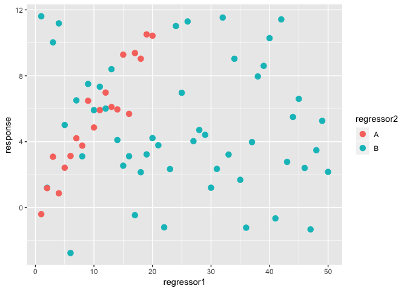

Linear model fitting examples
================

Example 1
---------

#### Generate data

``` r
set.seed(2)
regressor1<-c(1:20,1:50)
regressor2<-c(rep("A",20), rep("B",50))
response<-c(regressor1[1:20]*0.5+rnorm(20,0,1), rnorm(50,5,sqrt(10)))
dat<-data.frame(response,regressor1,regressor2)
dat<-dat[sample(1:nrow(dat),nrow(dat), replace = F),]
head(dat)
```

    ##     response regressor1 regressor2
    ## 13  6.107305         13          A
    ## 20 10.432265         20          A
    ## 43  2.338295         23          B
    ## 21 11.611751          1          B
    ## 30  5.915912         10          B
    ## 48  4.712725         28          B

Regressor 1 is continuous. Regressor 2 is categorical.

#### Visualize the data

``` r
library(ggplot2)
ggplot(data = dat, aes(x = regressor1, y = response, color = regressor2))+geom_point(size = 3)
```



#### The linear model

*y*<sub>*i*</sub> = *β*<sub>0</sub> + *β*<sub>1</sub>*x*<sub>*i*1</sub> + *β*<sub>2</sub>*x*<sub>*i*2</sub>
 or
\[*r**e**s**p**o**n**s**e*\]<sub>*i*</sub> = *β*<sub>0</sub> + *β*<sub>1</sub>\[*r**e**g**r**e**s**s**o**r*1\]<sub>*i*1</sub> + *β*<sub>2</sub>\[*B*\]<sub>*i*2</sub>
 where *B* = 0, 1

1.  Use two regressors

``` r
fit <- lm(response~1+regressor1+regressor2, data = dat)
summary(fit)
```

    ## 
    ## Call:
    ## lm(formula = response ~ 1 + regressor1 + regressor2, data = dat)
    ## 
    ## Residuals:
    ##     Min      1Q  Median      3Q     Max 
    ## -7.6048 -2.4538 -0.5215  2.6074  6.7653 
    ## 
    ## Coefficients:
    ##              Estimate Std. Error t value Pr(>|t|)    
    ## (Intercept)  5.434003   0.902362   6.022 8.12e-08 ***
    ## regressor1   0.001091   0.035015   0.031    0.975    
    ## regressor2B -0.588684   1.107512  -0.532    0.597    
    ## ---
    ## Signif. codes:  0 '***' 0.001 '**' 0.01 '*' 0.05 '.' 0.1 ' ' 1
    ## 
    ## Residual standard error: 3.685 on 67 degrees of freedom
    ## Multiple R-squared:  0.00513,    Adjusted R-squared:  -0.02457 
    ## F-statistic: 0.1727 on 2 and 67 DF,  p-value: 0.8417

1.  Use just regressor 1

``` r
fit <- lm(response~1+regressor1, data = dat)
summary(fit)
```

    ## 
    ## Call:
    ## lm(formula = response ~ 1 + regressor1, data = dat)
    ## 
    ## Residuals:
    ##     Min      1Q  Median      3Q     Max 
    ## -7.9073 -2.5151 -0.4151  2.3358  6.5810 
    ## 
    ## Coefficients:
    ##              Estimate Std. Error t value Pr(>|t|)    
    ## (Intercept)  5.200763   0.784315   6.631 6.51e-09 ***
    ## regressor1  -0.007735   0.030664  -0.252    0.802    
    ## ---
    ## Signif. codes:  0 '***' 0.001 '**' 0.01 '*' 0.05 '.' 0.1 ' ' 1
    ## 
    ## Residual standard error: 3.666 on 68 degrees of freedom
    ## Multiple R-squared:  0.0009349,  Adjusted R-squared:  -0.01376 
    ## F-statistic: 0.06363 on 1 and 68 DF,  p-value: 0.8016

1.  Use just regressor 2

``` r
fit <- lm(response~1+regressor2, data = dat)
summary(fit)
```

    ## 
    ## Call:
    ## lm(formula = response ~ 1 + regressor2, data = dat)
    ## 
    ## Residuals:
    ##     Min      1Q  Median      3Q     Max 
    ## -7.6261 -2.4391 -0.5199  2.5899  6.7386 
    ## 
    ## Coefficients:
    ##             Estimate Std. Error t value Pr(>|t|)    
    ## (Intercept)   5.4455     0.8180   6.657 5.85e-09 ***
    ## regressor2B  -0.5723     0.9679  -0.591    0.556    
    ## ---
    ## Signif. codes:  0 '***' 0.001 '**' 0.01 '*' 0.05 '.' 0.1 ' ' 1
    ## 
    ## Residual standard error: 3.658 on 68 degrees of freedom
    ## Multiple R-squared:  0.005116,   Adjusted R-squared:  -0.009515 
    ## F-statistic: 0.3497 on 1 and 68 DF,  p-value: 0.5563

1.  Use just category A

``` r
fit <- lm(response~1+regressor1, data = dat[dat$regressor2=="A",])
summary(fit)
```

    ## 
    ## Call:
    ## lm(formula = response ~ 1 + regressor1, data = dat[dat$regressor2 == 
    ##     "A", ])
    ## 
    ## Residuals:
    ##      Min       1Q   Median       3Q      Max 
    ## -2.57694 -0.45741  0.04638  0.62709  1.80821 
    ## 
    ## Coefficients:
    ##             Estimate Std. Error t value Pr(>|t|)    
    ## (Intercept)  0.06105    0.50391   0.121    0.905    
    ## regressor1   0.51280    0.04207  12.190 3.91e-10 ***
    ## ---
    ## Signif. codes:  0 '***' 0.001 '**' 0.01 '*' 0.05 '.' 0.1 ' ' 1
    ## 
    ## Residual standard error: 1.085 on 18 degrees of freedom
    ## Multiple R-squared:  0.892,  Adjusted R-squared:  0.886 
    ## F-statistic: 148.6 on 1 and 18 DF,  p-value: 3.915e-10

1.  Use just category B

``` r
fit <- lm(response~1+regressor1, data = dat[dat$regressor2=="B",])
summary(fit)
```

    ## 
    ## Call:
    ## lm(formula = response ~ 1 + regressor1, data = dat[dat$regressor2 == 
    ##     "B", ])
    ## 
    ## Residuals:
    ##     Min      1Q  Median      3Q     Max 
    ## -8.2421 -2.3408 -0.6046  2.2855  7.0714 
    ## 
    ## Coefficients:
    ##             Estimate Std. Error t value Pr(>|t|)    
    ## (Intercept)  5.67868    1.09930   5.166 4.57e-06 ***
    ## regressor1  -0.03159    0.03752  -0.842    0.404    
    ## ---
    ## Signif. codes:  0 '***' 0.001 '**' 0.01 '*' 0.05 '.' 0.1 ' ' 1
    ## 
    ## Residual standard error: 3.828 on 48 degrees of freedom
    ## Multiple R-squared:  0.01455,    Adjusted R-squared:  -0.005976 
    ## F-statistic: 0.7089 on 1 and 48 DF,  p-value: 0.404
